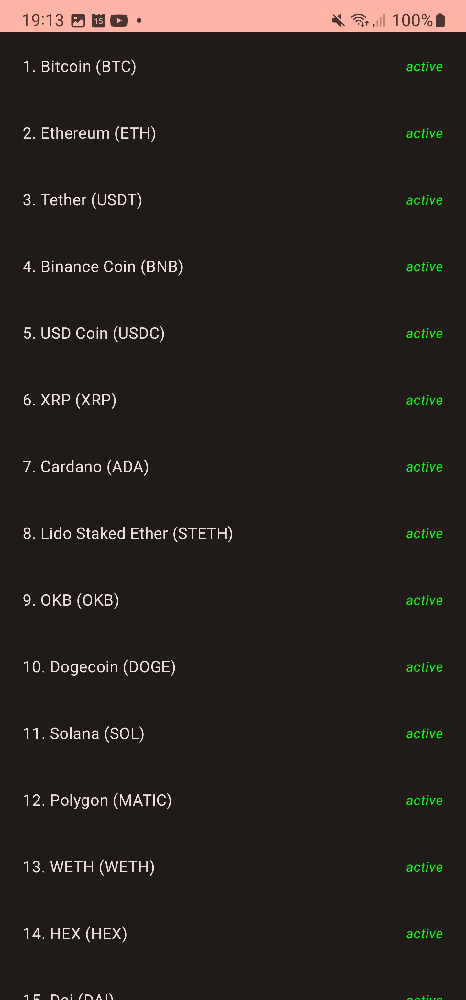

# Crypto Market Coins
Crypto market app with coinpaprika API
# Crypto Market app with coinpaprika API

The crypto market app is an easy to use app that displays the a list of all the top cryptocurrencies by market cap. The app uses the coinpaprika API to fetch the data and display it in a list. 

I made this app following the tutorial from [Coding](https://www.youtube.com/watch?v=EF33KmyprEQ). So I could improve my skills in Android Studio, Kotlin and clean architecture.

## Features
- Coinpaprika API to fetch the data
- Information about the coin
- Clean architecture

